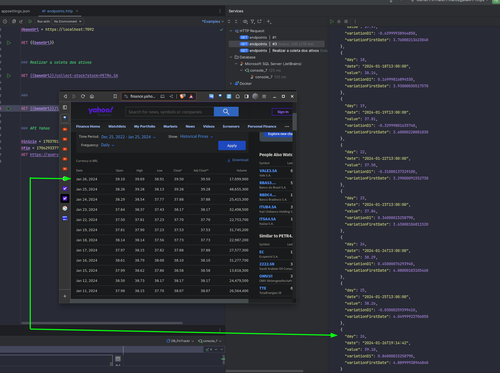
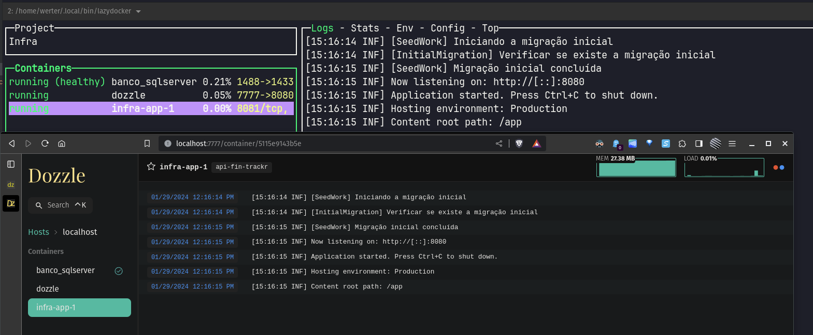

# Projeto DotNet - Werter FinTracker

Abaixo estão as instruções para configurar e executar o projeto em dois ambientes distintos: produção e desenvolvimento.

## Dependencias

- Dotnet 8
- Git
- Docker

## Configuração do Ambiente de Produção

Para executar o projeto em um ambiente de produção, siga os passos abaixo:

1. Clone o repositório do projeto:
   ```bash
   git clone https://github.com/WerterBonfim/desafio_ativos.git
   ```
2. Navegue até a pasta `Infra`:
   ```bash
   cd desafio_ativos/Infra
   ```
3. Execute o Docker Compose:
   ```bash
   docker compose up -d
   ```
4. Você pode visualizar os logs do sistema através do seguinte endereço:
   ```
   http://localhost:7777
   ```

## Configuração do Ambiente de Desenvolvimento

Para executar o projeto em um ambiente de desenvolvimento, siga os passos abaixo:

1. Navegue até a pasta `Infra` (assumindo que o repositório já foi clonado):
   ```bash
   cd desafio_ativos/Infra
   ```
2. Execute o Docker Compose com o arquivo de configuração de desenvolvimento:
   ```bash
   docker compose -p fin_trackr_dev -f docker-compose-dev.yml up -d
   ```
3. Os logs podem ser visualizados diretamente na IDE de sua preferência.


## Arquivo endpoints.http

O arquivo `endpoints.http` contém os mapeamentos das URLs dos endpoints do projeto. 
Optei por não utilizar o Swagger, pois a simplicidade dos endpoints permitiu uma abordagem mais direta. 
Para trabalhar com esse arquivo, você pode:

- Baixar uma extensão do Visual Studio Code que permita interpretar arquivos `.http`.
- Utilizar as IDEs Rider ou Visual Studio, que já possuem recursos integrados para interpretar e executar requisições a partir de arquivos `.http`.

Os arquivos `.http` são uma maneira conveniente de testar APIs diretamente de dentro de uma IDE, permitindo que você envie requisições HTTP sem a necessidade de ferramentas adicionais como Postman ou Curl.


## Bibliotecas Utilizadas

- **FluentResults**: Utilizada para encapsular resultados de operações, possibilitando o retorno de sucesso ou falha de forma fluente.
- **Serilog**: Biblioteca de logging avançada que permite o registro de eventos e dados estruturados.
- **Dapper**: Um micro ORM (Object-Relational Mapper) que facilita o mapeamento entre banco de dados e objetos .NET.

### Testes

- **FluentAssertions**: Fornece um conjunto de métodos de extensão para escrever asserções de código de forma mais legível.
- **xUnit**: Framework de testes para .NET que suporta testes parametrizados e teorias.
- **FakeItEasy**: Biblioteca de criação de objetos fictícios (mocks) para facilitar o isolamento de testes.

## Arquitetura e Estrutura do Projeto

Este projeto adota uma arquitetura modular monolítica, onde o código é organizado em módulos dentro de um único repositório. Isso facilita a manutenção e o desenvolvimento escalável, mantendo a simplicidade de um monólito.

Além disso, utilizamos o conceito de use cases na camada de API, o que permite uma separação clara entre a lógica de negócios e a interface do usuário, facilitando a testabilidade e a manutenção do código.


## Padrão UseCase

Neste projeto, estou utilizando o padrão UseCase para orquestrar cada tarefa. 
Isso significa que para cada ação ou conjunto de ações que o usuário pode realizar, há um UseCase correspondente que encapsula toda a lógica necessária para completar essa tarefa.


## Evidências

### Imagem 1


*Validação dos valores com Yahoo Finance.*

### Imagem 2


*Visualizando os logs através do navegador com a ferramenta Dozzle ou diretamante via lazydocker*


---

O projeto foi feito no Linux utilizando a IDE Rider e o banco de dados Sql Server Express.


Obrigado pela oportunidade.
